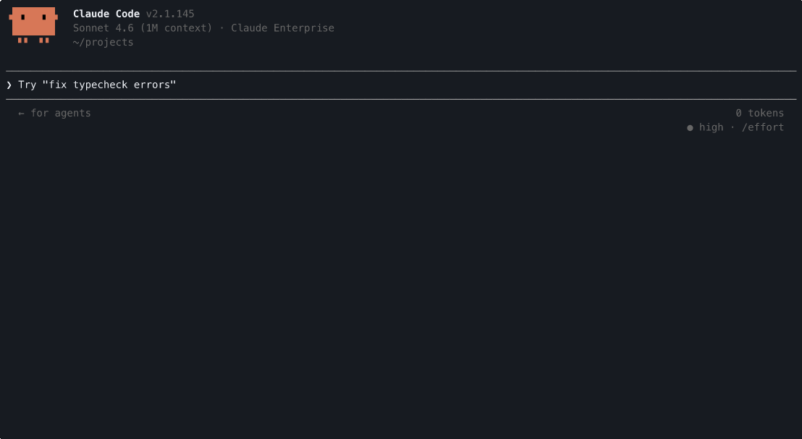

# CoreWeave Skills

Ask your AI coding agent to deploy a CoreWeave Kubernetes Service (CKS)
cluster, add a GPU node pool, deploy a vLLM inference endpoint, or load a model
into an object storage bucket. The agent carries out the CoreWeave workflow
for you, one step at a time.

CoreWeave Skills are [Agent Skills](https://agentskills.io), an open format for
packaging the instructions an AI coding agent needs to carry out a task. Each
skill is a guided workflow for one CoreWeave operation: it knows the
prerequisites, runs the commands, and includes checks of its own work. You
install the skills once, then describe what you want in plain language. Your
agent picks the right skill and runs it.

CoreWeave publishes and tests the skills for
[Claude Code](https://docs.claude.com/en/docs/claude-code/overview), and the
install steps below use Claude Code's plugin marketplace, served directly from
this repository. You don't need to clone the repository. Other agents that read
the Agent Skills format, such as Cursor and Codex, can load the same skill
files, but CoreWeave does not document or test those install paths.

Before you install, read
[License, safety, and responsibilities](#license-safety-and-responsibilities)
below. In short: the skills are proprietary and licensed only for use with
CoreWeave products and services; this repository is the only official
distribution channel for them; and you are responsible for the permissions and
credentials you provide to your agent, for the actions the agent takes, and for
the resulting resources and charges.

## Prerequisites

Before you install the skills, make sure you have the following:

- [Claude Code](https://docs.claude.com/en/docs/claude-code/overview),
  installed and running, or another agent that supports Agent Skills.
- A CoreWeave account.

Individual skills have their own requirements, which they list in their
`SKILL.md` and confirm before they start. Depending on the skill, you may need
a CoreWeave API access token, a kubeconfig for your cluster, command-line tools
such as Terraform, `kubectl`, the AWS CLI, `jq`, or the Hugging Face CLI
(`hf`), a Hugging Face account, or available quota. Skills that need CoreWeave
credentials walk you through creating them, and each skill tells you what else
is missing before it does any work.

## Install the skills

Skills are grouped into plugins, one plugin per CoreWeave product line. Install
the platform plugin plus whichever product-line plugins you use. The steps
below are for Claude Code.

1. Add the CoreWeave marketplace. You do this once per machine:

   ```text
   /plugin marketplace add coreweave/skills
   ```

2. Install the plugins you want. The platform plugin provides a standalone
   skill that verifies a workload is running, healthy, and using its GPUs.
   Install it alongside whichever product-line plugins you use:

   ```text
   /plugin install coreweave-platform-skills@coreweave-skills
   /plugin install coreweave-cks-skills@coreweave-skills
   /plugin install coreweave-storage-skills@coreweave-skills
   ```

3. Load the new skills into your current session:

   ```text
   /reload-plugins
   ```

After each install, Claude Code confirms with a line like `✓ Installed
coreweave-cks-skills. Run /reload-plugins to apply.` Running `/reload-plugins`
makes the skills available without restarting Claude Code.

To upgrade later, update the marketplace and reload:

```text
/plugin marketplace update coreweave-skills
/reload-plugins
```

## Use a skill

Once a plugin is installed, you can trigger a skill two ways:

- **Describe what you want.** Your agent reads each skill's description and
  routes to the right one automatically. "Create a CKS cluster" triggers
  `cw-create-cluster`. "Deploy a vLLM endpoint" triggers
  `cw-self-managed-inference`. "Load my model into a bucket" triggers
  `cw-load-model-to-bucket`.
- **Invoke a skill by name.** In Claude Code, run `/<plugin>:<skill>`, for
  example `/coreweave-cks-skills:cw-create-cluster`. Use this when you know
  exactly which workflow you want and don't want to rely on automatic routing.

Either way, the skill drives the workflow: it asks for the inputs it needs,
runs the commands, and attempts to verify the result before reporting back.

### See it in action

The following animation shows a real Claude Code session: adding the
marketplace, installing a plugin, reloading, then running
`/coreweave-cks-skills:cw-create-cluster` and watching the agent start the
work.



## What's available

Each plugin covers one CoreWeave product line. Install a plugin and you get all
of its skills.

| Plugin | What it helps you do |
| --- | --- |
| `coreweave-platform-skills` | Foundational, standalone workflows: confirm that a workload is running, healthy, and actually using its GPUs. Kubeconfig-fetching guidance is built into the skills that need cluster access rather than shipped as a separate skill. |
| `coreweave-cks-skills` | CoreWeave Kubernetes Service (CKS): create a cluster and its VPC, add a GPU or CPU node pool, and deploy a self-managed vLLM inference service. |
| `coreweave-storage-skills` | Storage workflows: load a model into a CoreWeave object storage bucket. |

Skills are added and updated over time. Additional plugins for networking and
SUNK (Slurm on Kubernetes) are in development but not yet published to the
marketplace. After you run `/plugin marketplace update coreweave-skills`, any
new skills in your installed plugins are picked up automatically. To see what
an installed plugin offers right now, ask your agent "which CoreWeave skills do
I have?"

## License, safety, and responsibilities

This repository is publicly viewable, but it is not open source. The skills are
proprietary and licensed only for use with CoreWeave products and services. By
downloading, installing, copying, modifying, or using the skills, you agree to
the terms in the [LICENSE](LICENSE).

CoreWeave and the CoreWeave logo are trademarks of CoreWeave, Inc. Under the
[LICENSE](LICENSE), you may not remove or alter any copyright, trademark, or
other proprietary notices, and you may not use CoreWeave's names, logos, or
trademarks except as reasonably necessary to accurately identify unmodified
Skills obtained from this repository.

This repository is the only official distribution channel for the skills:
install them with `/plugin marketplace add coreweave/skills`. CoreWeave does
not publish these skills through third-party marketplaces or skill
directories.

The skills are agent instructions, not a hosted CoreWeave service. When you load
or run a skill, your agent may use the permissions and credentials available to
it to run commands, access local files, call APIs, and create, update, or delete
resources in your CoreWeave account. These actions can include creating
credentials and provisioning billable infrastructure such as CKS clusters and
GPU node pools.

Depending on the skill, the agent runtime, and your configuration, some
commands, data access, or API calls may occur when the skill is loaded or
without a separate confirmation for every action. A skill's prompts,
checkpoints, and verification steps are guidance; they are not technical access
controls and do not guarantee that an action is safe, correct, or reversible.

Before loading or running a skill:

- Read its `SKILL.md` and review any scripts or other files it uses.
- Confirm which account, organization, project, cluster, and region the agent
  will act on.
- Review your agent's permissions and approval settings.
- Use the least-privileged credentials available and protect them as secrets.
- Where practical, test with a separate non-production account or organization,
  not merely a non-production project that shares broader credentials with
  production.
- Review expected costs, monitor resources created by the skill, and remove
  resources and credentials that you no longer need.

You are responsible for deciding whether to run a skill, for the permissions
and credentials you provide to your agent, for the actions the agent takes, and
for the resulting resources and charges. Your agreement with CoreWeave
continues to govern your use of CoreWeave products and services, including
resources created, modified, or deleted through a skill and any associated
charges.

Skills and content processed by an agent can be affected by prompt injection
and other malicious instructions. Install these skills only from the official
repository, as described above. Treat forks, modified copies, and other
sources as untrusted until you have reviewed them.

The skills are provided "AS IS," without warranties, service levels, or support
commitments. They may be changed, replaced, or removed. See the
[LICENSE](LICENSE) for the complete terms.

## Get help

For documentation, support, or contributions, use the following resources:

- For CoreWeave product documentation, see
  [docs.coreweave.com](https://docs.coreweave.com).
- To report a problem with a skill or request a new one, open an issue in this
  repository. Issues are handled on a best-effort basis. For help with your
  CoreWeave account or services, contact CoreWeave support.
- This repository does not accept external contributions. Pull requests from
  outside CoreWeave will be closed, though we're glad to receive suggestions and
  bug reports as issues.
